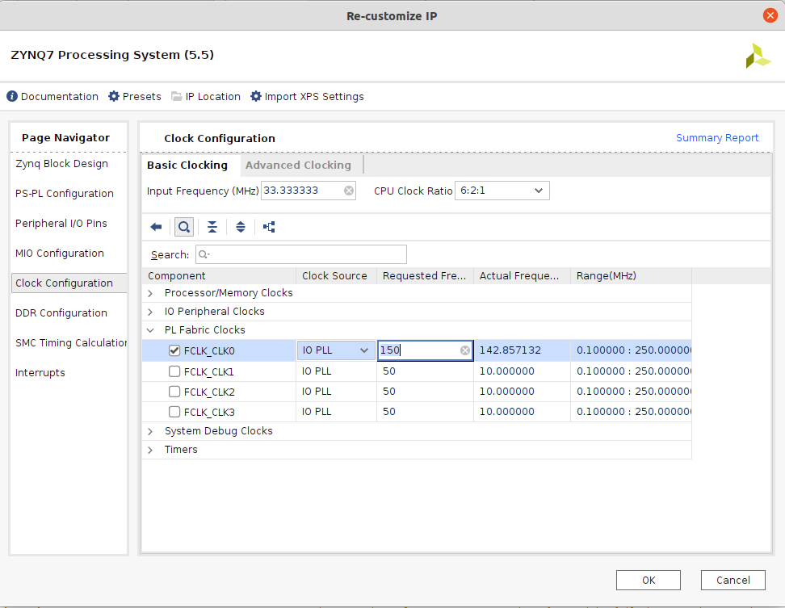
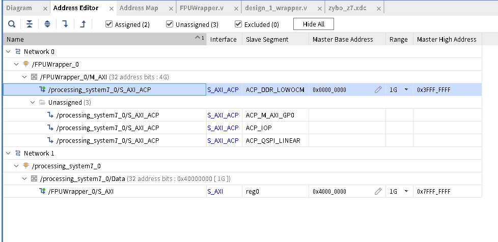
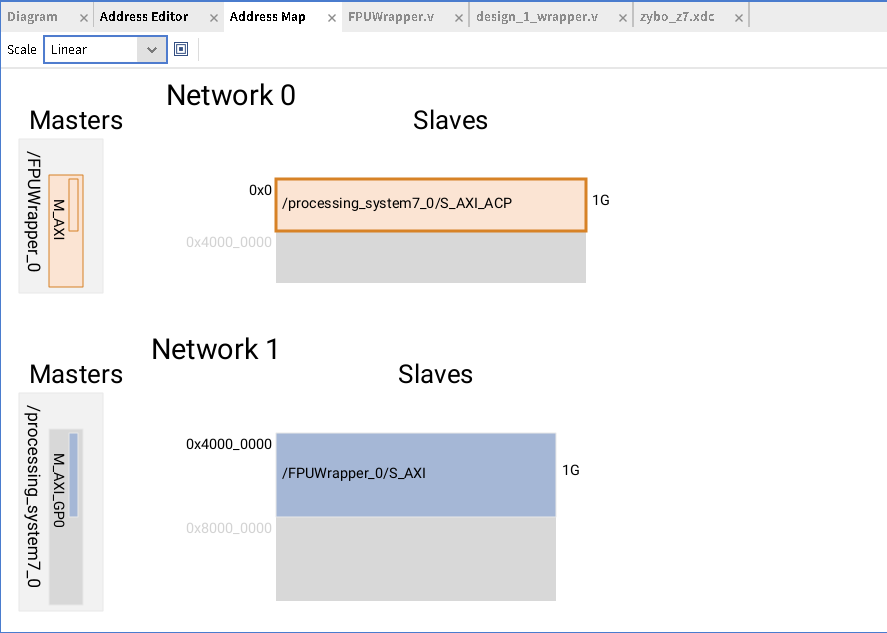

# Chisel3 FPU integration prototype

## 구현된 부분들

기초적인 부동 소수점 가감승제 구현

## 빌드 방법
### Scala 개발 환경 구축
#### Linux
배포판의 패키지 관리자를 이용해 sbt 를 설치한다.

#### 그 외
[Scala getting started](https://docs.scala-lang.org/getting-started/index.html) 문서를 이용하여, Scala 를 설치한다.

### 빌드
1. 이 프로젝트를 `git clone` 받는다
2. `git submodule update --init --recursive` 를 이용해 서브모듈을 받는다
3. `sbt run` 실행
4. 결과물로 `vout/FPUWrapper.v` 가 생성된다

### Vivado 프로젝트 설정
1. Vivado 프로젝트를 [다음 Notion 문서](https://www.notion.so/tsnlab/Zynq-Hello-world-75ef620c18484698bf9cf613568a48e0) 를 참조하여, 생성한다.
2. Create Block Design 이후, 꼭! Design Sources > design_1.bd (생성한 디자인 이름) 을 우클릭하여, Create HDL Wrapper 를 눌러 준다. 특별한 이유가 없다면, HDL Wrapper 를 만들 때 Vivado 가 자동으로 관리하도록 옵션을 선택한다.
3. ZYNQ IP core 를 위의 문서와는 다르게, 다음 구성으로 세팅한다.

4. 해당 창의 Clock configuration 에서, 주어진 clock port 의 clock 을 150MHz 로 세팅해준다. (이 프로젝트의 목표 clock) 
4. 다음 [XDC 파일](https://github.com/Digilent/digilent-xdc/blob/master/Zybo-Z7-Master.xdc)을 내려받는다
5. 해당 파일에서 다음 부분을 주석 해제한다:
```
#LEDs
set_property -dict {PACKAGE_PIN M14 IOSTANDARD LVCMOS33} [get_ports {led[0]}]
set_property -dict {PACKAGE_PIN M15 IOSTANDARD LVCMOS33} [get_ports {led[1]}]
set_property -dict {PACKAGE_PIN G14 IOSTANDARD LVCMOS33} [get_ports {led[2]}]
set_property -dict {PACKAGE_PIN D18 IOSTANDARD LVCMOS33} [get_ports {led[3]}]


#RGB LED 5 (Zybo Z7-20 only)
set_property -dict {PACKAGE_PIN Y11 IOSTANDARD LVCMOS33} [get_ports led5_r]
set_property -dict { PACKAGE_PIN T5    IOSTANDARD LVCMOS33 } [get_ports { led5_g }]; #IO_L19P_T3_13 Sch=led5_g
set_property -dict { PACKAGE_PIN Y12   IOSTANDARD LVCMOS33 } [get_ports { led5_b }]; #IO_L20P_T3_13 Sch=led5_b
```
6. 편집한 xdc 파일을 IP Integrator > Open Block Design > Constraints (right click) > Add sources 를 이용해 추가한다.
7. 전 단계에서 빌드한 Verilog 파일 `FPUWrapper.v` 를, IP Integrator > Open Block Design > Design Sources (right click) > Add sources 를 이용해 추가한다.
8. LED 포트를 다음 단계를 거쳐 추가한다: IP Integrator > Open Block Design > Diagram 탭 안에서 right click > Create Port


9. 다음 그림과 같이, Block diagram 을 만든다

해당 그림에서 NOT 게이트는 Diagram 탭 안 Right click > Add IP > Utility Vector Logic 검색 후 추가한 뒤, 생성된 블럭 더블클릭하여 Vector size 1 짜리 NOT 게이트로 설정하여 연결한다.
10. Address Editor 는 다음과 같이 설정한다. (설정 안 해도 동작하지만, 설정해 주는 것을 권장함)


11. 이후 위의 Notion 문서에 언급된 대로 보드 내보내기를 하여, 추가 과정을 진행한다. 이 때, Include Bitstream 을 하여 보드를 내보내면, Vitis 에서 한 번에 프로그램할 수 있지만, 추후 [Xilinx ILA](https://www.xilinx.com/products/intellectual-property/ila.html) 와 같은 도구를 사용해 디버깅을 해야 할 경우, Vivado 에서 별도로 비트스트림을 프로그램해야 해당 기능을 사용할 수 있다.


## Register map
#### Control register
제어 레지스터 주소: 0x4000\_0000

제어 레지스터 맵:

| Bit   | Description                         |
|-------|-------------------------------------|
| 0     | Start: 1이면 연산 시작              |
| 1     | Busy: 1이면 연산중                  |
| 2-7   | Reserved                            |
| 8-9   | Opcode. 0: Add 1: Sub 2: Mul 3: Div |
| 10-15 | Reserved                            |
| 16-31 | Reserved                            |

#### Data register

In A (operation) B = Y,

| Address     | Value |
|-------------|-------|
|0x4000\_0004 | \*A   |
|0x4000\_0008 | \*B   |
|0x4000\_000C | \*Y   |


## Errata

* 데이터 레지스터에 들어가는 주소는 반드시 버스 폭에 맞게 정렬되어 있어야 함.

## C 코드 예제
```
#include "xil_cache.h"

// ...

// Align stack variable to 4 byte offset
// Note: Depends on hardware.
float a __attribute__ ((aligned (8)));
float b __attribute__ ((aligned (8)));
volatile float c __attribute__ ((aligned (8)));

// Set up values on a, b, c
// Flush
Xil_DCacheFlushRange((INTPTR)&a, sizeof(float));
Xil_DCacheFlushRange((INTPTR)&b, sizeof(float));

// CAUTION!! 32-bit system only.
// Replace address properly before running it on 64bit ZYNQ
volatile uint32_t *flagreg = (uint32_t*) 0x40000000;
volatile uintptr_t *reg_a   = (uintptr_t*) 0x40000004;
volatile uintptr_t *reg_b   = (uintptr_t*) 0x40000008;
volatile uintptr_t *reg_c   = (uintptr_t*) 0x4000000C;

*reg_a = (uintptr_t) &a;
*reg_b = (uintptr_t) &b;
*reg_c = (uintptr_t) &c;

*flagreg = 0x00000001 | (0x00 << 8); // 위 테이블 참조하여 계산 opcode 설정

while(!(*flagreg & 0x01));

Xil_DCacheInvalidateRange((INTPTR)&c, sizeof(float));

// Grab value from C
```